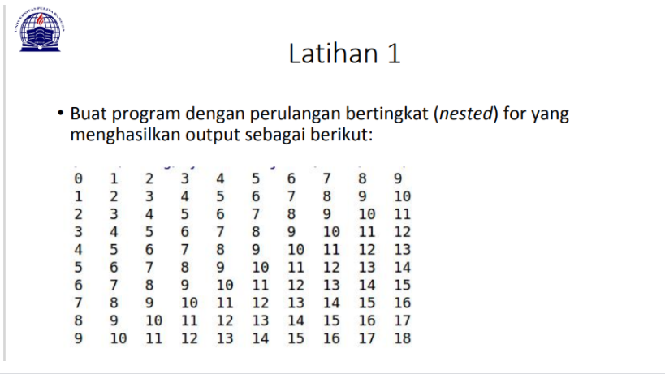
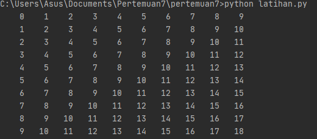

# PRAKTIKUM 1 - LATIHAN 1

Pada tugas pertama, saya diminta untuk membuat sebuah program pengulangan bertingkat yang nantinya akan menghasilkan output seperti gambat diatas. Untuk bisa dapat menghasilkan output tersebut maka saya memasukan syntax:

baris = 10
kolom = baris

for bar in range(baris):
    for col in range(kolom):
        tab = bar+col
        print("{0:>5}".format(tab), end='')
    print()
Mengapa demikian? Karena untuk dapat melakukan pengulangan bertingkat kamu perlu memasukan

for bar in range(baris):
    for col in range(kolom):
        tab = bar+col
        print("{0:>5}".format(tab), end='')
    print()
dan karena pada syntax tersebut kamu membutuhkan baris dan kolom maka sebelum memasukan syntax diatas kamu perlu menambahkan keterangan baris dan kolom sesuai yang kalian butuhkan seperti ini.

baris = 10
kolom = baris
Jika sudah memasukan semua syntax diatas dan telah di run, maka kamu akan mendapatkan tampilan seperti gambar yang ada dibawah ini

